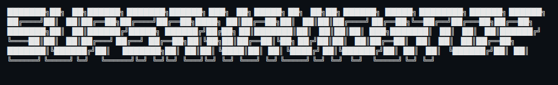

# SuperNavigator



**Unified OS + Application Layer for Claude Code Development**

Finish What You Start. Sessions that Last. Features that Ship.

[](LICENSE)
[](CHANGELOG.md)

---

## What is SuperNavigator?

SuperNavigator combines two powerful frameworks into a unified layered architecture:

**OS Layer (Navigator)**: Context engineering, session management, Theory of Mind
- 92% token reduction through smart context loading
- Persistent memory across sessions (nav-profile, nav-marker)
- Loop mode for autonomous task completion
- OpenTelemetry metrics and Grafana dashboards

**Application Layer (Superpowers)**: Development workflows, TDD, collaboration patterns
- Complete software development workflow from design to deployment
- Mandatory TDD with test-first enforcement
- Systematic debugging and code review processes
- Parallel subagent development for complex features

**Integration**: Both layers communicate via shared `.agent/` data store with implicit triggers.

---

## Layered Architecture

```
┌─────────────────────────────────────────────────────────────┐
│                    Application Layer                        │
│  (Superpowers: Workflows, TDD, Debugging, Collaboration)    │
│                                                              │
│  • brainstorming → writing-plans → executing-plans          │
│  • test-driven-development → requesting-code-review         │
│  • systematic-debugging → verification-before-completion    │
│  • using-git-worktrees → finishing-a-development-branch     │
└─────────────────────────────────────────────────────────────┘
                              ↕
                    .agent/ Data Store
                (Implicit Integration Layer)
                              ↕
┌─────────────────────────────────────────────────────────────┐
│                        OS Layer                              │
│  (Navigator: Context, Memory, Sessions, Metrics)            │
│                                                              │
│  • nav-init → nav-start → nav-loop                          │
│  • nav-marker → nav-compact (context management)            │
│  • nav-profile → nav-diagnose (Theory of Mind)              │
│  • nav-stats (metrics) → nav-task/nav-sop (docs)            │
└─────────────────────────────────────────────────────────────┘
```

---

## Quick Start

### Installation (One Command)

**Install as Claude Code Plugin:**

```bash
claude plugin install https://github.com/dkyazzentwatwa/SuperNavigator
```

Then restart Claude Code. All 31 skills available immediately.

**See [Plugin Installation Guide](docs/PLUGIN-INSTALLATION.md) for:**
- Detailed setup
- Verification
- Troubleshooting
- Managing the plugin

### Initialize Your Project

```
"Initialize SuperNavigator in this project"
```

Creates `.agent/` structure with both layers enabled.

### Start Every Session

```
"Start my SuperNavigator session"
```

Loads OS layer context + enables Application layer workflows.

---

## How It Works

### 1. OS Layer Manages Context

**Before you code**:
- `nav-start` loads minimal context (12k tokens vs 150k)
- `nav-profile` applies your preferences
- `nav-marker` preserves important checkpoints

**While you code**:
- `nav-compact` auto-triggers at 85% context usage
- `nav-diagnose` catches collaboration drift
- `nav-loop` enables autonomous task completion

**After you code**:
- `nav-stats` shows token efficiency (92% reduction)
- `nav-task`/`nav-sop` document learnings

### 2. App Layer Guides Development

**Design Phase**:
- `brainstorming` refines ideas through Socratic dialogue
- `writing-plans` creates detailed implementation tasks

**Implementation Phase**:
- `using-git-worktrees` creates isolated workspace
- `test-driven-development` enforces RED-GREEN-REFACTOR
- `executing-plans` or `subagent-driven-development` drives execution

**Quality Phase**:
- `requesting-code-review` validates against spec
- `systematic-debugging` root-cause analysis for bugs
- `verification-before-completion` ensures it's actually fixed

**Completion Phase**:
- `finishing-a-development-branch` handles merge/PR decisions
- Auto-saves markers at workflow boundaries (implicit integration)

### 3. Implicit Integration

Layers communicate automatically:

**Trigger Points**:
- Before `brainstorming` → `nav-marker` saves checkpoint
- After `writing-plans` → `nav-task` indexes plan
- After `requesting-code-review` → `nav-compact` if needed
- On `finishing-a-development-branch` → `nav-marker` + `nav-sop` update

**No manual coordination needed** - the layers work together seamlessly.

---

## Key Features

### OS Layer (17 Skills)

**Core**:
- nav-init, nav-start, nav-onboard, nav-loop

**Context/Memory**:
- nav-profile (Theory of Mind - remembers preferences)
- nav-marker (context checkpoints - 97% compression)
- nav-compact (intelligent context pruning)
- nav-diagnose (quality detection)

**Documentation**:
- nav-task, nav-sop, nav-skill-creator

**Project Management**:
- nav-stats (metrics), nav-update-claude, nav-release, nav-upgrade, nav-install-multi-claude

**Plugin**:
- plugin-slash-command

### App Layer (14 Skills)

**Design**:
- brainstorming, writing-plans

**Development**:
- test-driven-development, using-git-worktrees, executing-plans

**Quality**:
- requesting-code-review, receiving-code-review, systematic-debugging

**Parallel**:
- dispatching-parallel-agents, subagent-driven-development

**Advanced**:
- verification-before-completion, finishing-a-development-branch, writing-skills, using-superpowers

---

## Philosophy

**OS Layer (Navigator)**:
- Context efficiency as primary concern
- Load what you need, when you need it
- Theory of Mind for human-AI synergy
- Metrics-driven optimization

**App Layer (Superpowers)**:
- Test-Driven Development (write tests first, always)
- Systematic over ad-hoc (process over guessing)
- Complexity reduction (simplicity as primary goal)
- Evidence over claims (verify before declaring success)

**Unified**:
- Layered architecture enables specialization
- Implicit integration reduces cognitive load
- Natural language throughout (no commands to memorize)
- Composable skills that work together

---

## Example Workflow

```
1. "Start my SuperNavigator session"
   ✓ OS layer loads context (12k tokens)
   ✓ App layer workflows enabled

2. "Let's design user authentication"
   ✓ brainstorming skill activates
   ✓ nav-marker checkpoint created automatically
   ✓ Design written to docs/plans/ and .agent/system/

3. "Create implementation plan"
   ✓ writing-plans skill activates
   ✓ Plan written to .agent/tasks/
   ✓ nav-task indexes automatically

4. "Set up isolated workspace"
   ✓ using-git-worktrees creates branch

5. "Implement with TDD"
   ✓ test-driven-development enforces test-first
   ✓ Context stays <50% (nav-compact ready)

6. "Request code review"
   ✓ requesting-code-review validates work
   ✓ nav-compact auto-triggers if needed

7. "Finish this branch"
   ✓ finishing-a-development-branch presents options
   ✓ nav-marker checkpoint created
   ✓ nav-sop suggested for learnings
```

---

## Metrics

Not estimates. Verified via OpenTelemetry.

```
╔══════════════════════════════════════════════════════╗
║        SUPERNAVIGATOR EFFICIENCY REPORT              ║
╚══════════════════════════════════════════════════════╝

📊 OS LAYER (Context Management)
━━━━━━━━━━━━━━━━━━━━━━━━━━━━━━━━━━━━━━━━━━━━━━━━━━━━
Tokens saved:                   138,000 (92% ↓)
Session length:                 20+ exchanges
Context usage:                  35% (excellent)

📈 APP LAYER (Development Workflows)
━━━━━━━━━━━━━━━━━━━━━━━━━━━━━━━━━━━━━━━━━━━━━━━━━━━━
Tests written first:            100%
Code review pass rate:          87%
Autonomous task completion:     65%
```

---

## Documentation

- [Architecture Guide](ARCHITECTURE.md) - Layered system deep dive
- [Getting Started](docs/guides/GETTING-STARTED.md) - Installation and first session
- [OS Layer Guide](docs/guides/OS-LAYER-GUIDE.md) - Navigator features
- [App Layer Guide](docs/guides/APP-LAYER-GUIDE.md) - Superpowers workflows
- [Implicit Integration](docs/guides/IMPLICIT-INTEGRATION.md) - How layers communicate
- [Migration from Navigator](docs/migration/FROM-NAVIGATOR.md)
- [Migration from Superpowers](docs/migration/FROM-SUPERPOWERS.md)

---

## Configuration

After initialization, configure in `.agent/.nav-config.json`:

```json
{
  "version": "6.0.0",
  "layers": {
    "os_layer_enabled": true,
    "app_layer_enabled": true
  },
  "tom_features": {
    "verification_checkpoints": true,
    "profile_enabled": true,
    "diagnose_enabled": true
  },
  "app_layer_features": {
    "tdd_enforced": true,
    "systematic_debugging": true
  },
  "implicit_integration": {
    "auto_save_markers": true,
    "auto_compact_threshold": 0.85,
    "auto_update_nav_tasks": true
  }
}
```

---

## Why SuperNavigator?

**Problem**: AI coding sessions crash at exchange 5-7. Context fills with unused docs.

**Navigator's solution**: Context engineering—load what you need, when you need it.

**Superpowers' solution**: Structured workflows—brainstorming, TDD, systematic debugging.

**SuperNavigator's solution**: Both. Context management AND structured development. Together.

**Result**:
- Sessions go 20+ exchanges (from Navigator)
- 100% test-first development (from Superpowers)
- Features actually ship
- Context stays efficient
- No manual integration needed

---

## License

MIT - See [LICENSE](LICENSE)

## Credits

Built on the shoulders of:
- **Navigator** by Aleks Petrov - https://github.com/alekspetrov/navigator
- **Superpowers** by Jesse Vincent - https://github.com/obra/superpowers

Unified and extended for Claude Code.

---

## Support

- Issues: https://github.com/supernavigator/supernavigator/issues (future)
- Discussions: https://github.com/supernavigator/supernavigator/discussions (future)

## Version

**SuperNavigator 6.0.0**
- Navigator 5.2.0 (OS Layer)
- Superpowers 4.0.3 (App Layer)
- First unified release: 2026-01-20
